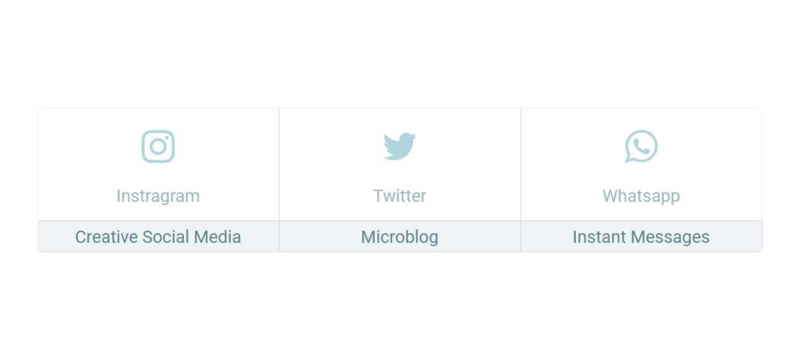

<h1 align="center"> Desafio Flexbox Desenvolve Boticario 2023 </h1>
 

  
  

> Status do Projeto: :heavy_check_mark: 

### Tópicos 

:small_blue_diamond: [Descrição do projeto](#descrição-do-projeto)

:small_blue_diamond: [Layout e Deploy da Aplicação](#layout-e-deploy-da-aplicação)

:small_blue_diamond: [Pré-requisitos](#pré-requisitos)

## Descrição do projeto 

  Main view bar Web, desenvolvido a partir de HTML e CSS simples, requisitado como primeiro desafio da Desenvolve Boticário - 2023 e com o objetivo de exercitar a aplicação de flexbox.  

## Layout e Deploy da Aplicação

> Link do deploy da aplicação:

## Pré-requisitos

Não existe nenhum pré-requisito para executar esse projeto. Basta clonar o repositório na sua máquina.

## Autor

[ Vinícius Reis](https://github.com/viniR15) 

## Licença 

The [MIT License]() (MIT)
